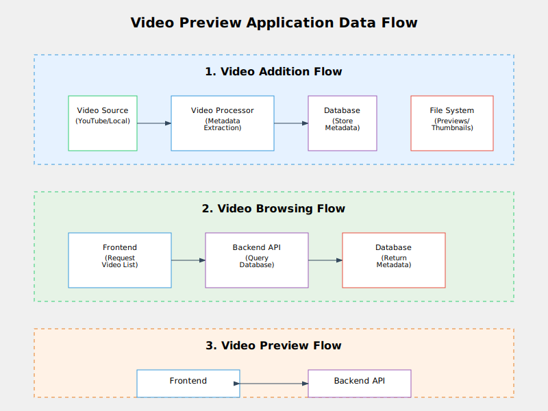

# Video Preview Application

A full-stack web application for generating, managing, and viewing video previews from both local files and YouTube sources. This app was developed to allow media creators to show off their work in a well-known design-format.

**Live Demo:** [https://oliflix-5b6d7a3b9c18.herokuapp.com//](https://oliflix-5b6d7a3b9c18.herokuapp.com/)


## Overview

This application provides a platform to create and view thumbnails and preview clips from videos. It consists of:

- **Backend**: A FastAPI API server that handles video processing, database management, and serving preview data
- **Frontend**: A web interface for browsing and viewing the video previews

## Features

- Support for both local video files and YouTube videos
- Automatic generation of thumbnails and preview clips
- Preview storage and management in a SQLite database
- Responsive web interface for browsing the video collection
- GIF and MP4 preview generation for quick previews

## Long-term Considerations for Heroku Deployment

Database: Replace SQLite with PostgreSQL
File Storage: Replace local file storage with Amazon S3 or similar and add video solution for full res local videos
Environment Variables: Configure sensitive information as Heroku config vars

## Architecture

The application uses a modular, two-tier architecture:


### System Architecture

The Video Preview Application is designed as a modular, two-tier system comprised of:

1. **Frontend Tier**: Handles user interface and media proxying
   - FastAPI web application with Jinja2 templates
   - Browsing interface for the video collection
   - Video preview player functionality
   - Media proxy to serve backend content

2. **Backend Tier**: Provides API endpoints and processing
   - FastAPI REST endpoints for video data
   - Video service layer for business logic
   - Video processing orchestration
   - Database management

### Component Details

#### 1. Frontend Application (FastAPI)
- Provides the user interface with responsive design
- Routes for home page, video playback, and search
- Proxies media requests to the backend
- Error handling and fallback mechanisms

#### 2. Backend API (FastAPI)
- RESTful API endpoints for video metadata
- Static file serving for previews and thumbnails
- Filtering capabilities (by creator, year, etc.)
- Related video recommendations

#### 3. Video Processing System
- Central coordinator for the ETL process
- Preview generation in multiple formats (GIF, MP4)
- Thumbnail extraction from representative frames
- Metadata extraction and organization

#### 4. Source Adapters
- Plugin-based architecture for different video sources
- YouTube video download and metadata extraction
- Local file processing with metadata from text files
- Content hash generation for duplicate detection

#### 5. Data Storage
- SQLite database for metadata and relationships
- File system for binary data (videos, thumbnails, GIFs)
- User-specific directory organization
- JSON export for backup and portability

### Data Flow

1. **Video Addition Flow**:
   - Video source is identified and processed
   - Metadata is extracted and stored in database
   - Thumbnails and previews are generated
   - Preview files are stored in the file system

2. **Video Browsing Flow**:
   - Frontend requests video listing
   - Backend queries database and returns metadata
   - Frontend displays thumbnails and metadata
   - User selects a video to preview

3. **Video Preview Flow**:
   - Frontend requests specific preview
   - Backend serves the pre-generated preview file
   - Frontend displays the preview in the player

### Video Watch Page


## Installation

### Prerequisites

- Python 3.10 or higher
- FFmpeg (for video processing)
- UV - a modern Python packaging tool

### Setup

1. Clone the repository:
   ```
   git clone https://github.com/yourusername/video-preview-app.git
   cd video-preview-app
   ```

2. Create a virtual environment and install dependencies using UV:
   ```
   # Install UV if you don't have it already
   pip install uv

   # Create a virtual environment and install dependencies
   uv venv
   uv pip install -r requirements.txt
   ```

3. Configure the application (optional):
   - Edit `config.json` to customize ports and data directory
   - Or use environment variables (see Configuration section)

## Usage

### Basic Usage

Start both frontend and backend servers with default settings:

```
uv run main.py
```

Then open your browser to `http://localhost:8001` to access the application.

### Advanced Usage

**Run only the backend:**
```
uv run main.py --backend-only --backend-port 9000
```

**Run only the frontend, connecting to a specific API:**
```
uv run main.py --frontend-only --frontend-port 3000 --api-url http://api.example.com
```

**Use a different data directory:**
```
uv run main.py --data-dir /path/to/data
```

### Adding Videos

Videos can be added to the system using the command-line tool:

```
# Add a YouTube video
uv run backend/videos2db.py --url "https://www.youtube.com/watch?v=xxxx" --user username

# Process all videos in a local directory
uv run backend/videos2db.py --local-dir /path/to/videos --user username

# Process videos from a text file with URLs/paths (one per line)
uv run backend/videos2db.py linkliste.txt --user username
```

## Configuration

Configuration options can be set in multiple ways, with the following priority:

1. Environment variables (highest priority)
2. Command-line arguments
3. Values from `config.json`
4. Default values

### Available Configuration Options

| Option        | Config Key    | Env Variable   | Default     | Description                       |
|---------------|---------------|----------------|-------------|-----------------------------------|
| Backend Port  | backend_port  | BACKEND_PORT   | 8000        | Port for the backend API server   |
| Frontend Port | frontend_port | FRONTEND_PORT  | 8001        | Port for the frontend web server  |
| Data Directory| data_dir      | DATA_DIR       | ./data      | Location for video data storage   |
| API URL       | api_url       | API_URL        | (localhost) | URL for the backend API           |

## Deployment

The application can be deployed in two ways:

### Local Deployment

Follow the installation and usage instructions above to run the application locally.

### Heroku Deployment

The application is deployed on Heroku at:
[https://mypersonalnetflix-52bd709f2d61.herokuapp.com/](https://mypersonalnetflix-52bd709f2d61.herokuapp.com/)

To deploy your own instance to Heroku:

1. Create a new Heroku app
2. Set the buildpack to Python
3. Configure the environment variables as needed
4. Deploy from your Git repository

## Development

### Project Structure

```
.
├── backend/               # Backend server and video processing logic
│   ├── backend_api.py     # FastAPI backend server
│   ├── video_service.py   # Video service coordination
│   ├── videos2db.py       # Database operations
│   └── src/               # Core processing modules
│       ├── base_source.py       # Abstract base class for video sources
│       ├── create_gif_preview.py # GIF preview generator
│       ├── create_preview.py    # Video preview generator
│       ├── db_helper.py         # Database utility functions
│       ├── local_source.py      # Local file video source
│       ├── video_processor.py   # Video processing pipeline
│       ├── youtube_source.py    # YouTube video source
│       └── youtube_url_checker.py # YouTube URL validation
├── data/                 # Data storage directory
│   ├── videos.db         # SQLite database
│   └── [creator]/        # Subdirectories for each creator's content
│       ├── previews/     # Video and GIF previews
│       └── thumbnails/   # Video thumbnails
├── frontend/             # Frontend web application
│   ├── frontend_app.py   # FastAPI frontend server
│   ├── static/           # Static assets (CSS, JS)
│   └── templates/        # HTML templates
├── tests/                # Test suite
├── config.json           # Application configuration
└── main.py               # Main application launcher
```

### Extension Points

The application is designed to be extensible in several ways:

1. **New Video Sources**:
   - Implement `base_source.VideoSource` interface
   - Register in `video_processor.py`

2. **Additional Preview Types**:
   - Add new preview generator in `src/`
   - Update the processor pipeline

3. **UI Customization**:
   - Modify templates and CSS
   - Add new frontend routes as needed

### Running Tests

```
uv run -m pytest tests/
```

## License

[MIT License](LICENSE)

## Contributing

Contributions are welcome! Please feel free to submit a Pull Request.
